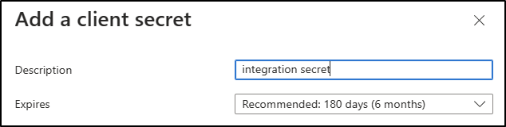
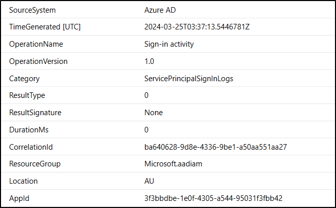

# Overview

This guidance has been published by Microsoft to help defender teams to both help secure their Microsoft Entra ID application landscape and to arm responders with the knowledge to properly respond to compromise of an application.

Although some example hunting queries for Microsoft Sentinel and Microsoft Defender XDR Advanced Hunting are provided in this guidance, the advice and recommendations are designed to be used by anyone, regardless of security technology stack.

This guidance should be shared with internal response teams or incident response partners.

## About Microsoft Entra ID applications 

Applications in Microsoft Entra ID allow the delegation of identity and management functions. To think of it simply, if you had a Payroll platform in your company that used Microsoft Entra ID to access, and you needed that Payroll platform to perform actions on your behalf, you could register an application and provide it access to perform those actions.

That application may be granted access to read your Microsoft Entra ID directory, so that it could fill in the user details, such as names and phone numbers, for users of the Payroll platform. It may integrate with other services too, such as Microsoft SharePoint Online, because Payroll information is stored there.

You can register an application in the Microsoft Entra ID portal, or via various command line tools.


When creating an application in this way in the portal, a service principal object is also created in your directory. While there are differences between application and service principal objects, for the sake of this guidance, the terms are used interchangeably.

## Understanding permissions with Microsoft Entra ID applications

When creating an application in Microsoft Entra ID, permissions (or privileges) can be granted to the application. This is required for the application to perform its functions. For instance, in our hypothetical Payroll example, if our application needs to access data in SharePoint Online, then it will need to be granted permission to access SharePoint.

There are two types of permissions with applications, and the difference is important for defenders and administrators to realise.

### Delegated Permissions

Delegated permissions mean that the application is acting on behalf of a user and the application is granted the same permissions that the user signing into it would have. Taking our Payroll example, if the Payroll application has been granted delegated read access to SharePoint, and a user signs in, the Payroll application can only access data in SharePoint that the user themselves could access.

Delegated permissions are often referred to as scopes.

### Application Permissions

Application permissions are used when the application acts on its own with no signed in user. In general these permissions are used for automation tasks, backup jobs or other automation. In these scenarios, the permissions are not bound by a user signing in and the application will be able to access any data that the permission is associated with. In our Payroll example, if the Payroll app was granted application level read permissions to SharePoint, then it could read all the data in SharePoint.

Application permissions are often referred to as app roles.

In general, only an administrator or similarly privileged user can consent to application permissions.

It is important to note, that many Microsoft services provide capability to limit application level permissions. These will be explained in the article under permissions and other best practices.

The permissions on an application can be viewed by selecting the API permissions tab on the application object in the Microsoft Entra ID portal


In our example. our Payroll Integration app has two delegated permissions and two application permissions. 

Our delegated permissions are User.Read, which allows the application to sign users in and read their user profile, and Directory.Read.All, so the Payroll Integration application can read anything in the directory that the user that signs in can.

Our application permissions are Mail.Read and Files.Read.All, so the application can read any email in Exchange Online and any data in SharePoint online, without requiring a user to sign in.

You also may see permissions that have been added to an application, but not yet consented to. The application will not have these permissions until an admin provides consent.


## Understanding credentials with Microsoft Entra ID application 

In order to provide access to services such as SharePoint or Exchange Online, credentials must be generated for the Microsoft Entra ID application, and those credentials used to authenticate.

Once authenticated, a token is provided for Microsoft Entra ID, and that token can be consumed by these other services to complete the actions required.

There are two main types of credentials that can be used, secrets and certificates.

### Secret credentials

A secret is much like a password, and is a long string of text generated automatically for you within the portal.

You can generate a secret on an application on the 'Certificates & secrets' tab on the application portal in Microsoft Entra ID.

When generating a secret, you can give the secret a description and an expiry date. Once the secret has expired, it can no longer be used for authentication.



Once you generate a secret, you must store it securely, as it will no longer be visible in the portal once you refresh the page.

Importantly, once a secret is generated, it is given a unique Secret ID (or credential identifier)


This is not the secret itself, but rather a guid that identifies that particular secret. This is important, because unlike a user who can only have one password on their account, an application can have many credentials. 


This identifier can be used to identify which credential was used at sign in and is crucial to determining post compromise activity. 

### Certificate credentials

Certificate credentials allow administrators to upload the public key of a certificate, the private key is then provided during authentication, and the application authenticated. These certificates can be self signed, or generated from PKI environments.


When generating a certificate, you can select a validity period, and much like a secret, when it expires, that certificate can no longer be used.


Like secrets, you can have multiple certificates on an application. Each is identified by a Certificate ID, and additionally, the thumbprint of the certificate.

Once you have a credential, you can combine that with the Application ID (or client ID) and the tenant ID and authenticate to the application.


## Sign in telemetry for applications

Much like user sign ins, application sign in events are tracked within the Microsoft Entra ID portal, and optionally can be sent to your SIEM, such as Microsoft Sentinel for analysis.

You can select Service principal sign-ins in the portal


For example, looking at a sign in for our Payroll Integration application.


We can see our Application (client) ID, the type of credential used, and the credential key ID. This is a match to one of the identifiers on the application. 


Another valuable piece of information is the Resource field, this shows what service or resource the application accessed, in this case Microsoft Graph. If the application had connected to Exchange Online, then the resource would be 'Office 365 Exchange Online', for Azure Key Vault, it would be 'Azure Key Vault'. If you use Microsoft Entra ID to protect your own custom APIs, then they may be listed too. This is crucial to determine post compromise activity.

Additional tabs show things such as location and IP address infomration, and Conditional Access diagnostics.

If you send application & service principal sign in logs to Microsoft Sentinel (or another SIEM) the same information is available there.

```kql
AADServicePrincipalSignInLogs
| where AppId == "3f3bbdbe-1e0f-4305-a544-95031f3fbb42"
```



## Safe credential handling and best practices

[Managed identities](https://learn.microsoft.com/en-us/entra/identity/managed-identities-azure-resources/overview) are a special type of service principal which negate the need for developers or administrators to manage credentials at all. Azure resources, such as a virtual machine or a logic app, can have an identity created for it. That identity can then access other Azure services without the need to handle credentials. For example, a Logic App can have an identity created for it, and that identity used to access Azure Storage without needing to create any actual credentials. 

A list of Azure services that support managed identities is documented [here](https://learn.microsoft.com/en-us/entra/identity/managed-identities-azure-resources/managed-identities-status)

If credentials are required because your use case includes services that aren't supported by managed identities then it is recommended that they are stored securely in a credential vaulting solution such as Azure Key Vault and retrieved only when required.

If secrets or certificates need to be provided to developers, administrators or third parties, then it is recommended that the secret is sent separately to the Application ID and Tenant ID. Secrets should be short-lived and rotated regularly.

For certificates, the password for the private key should be sent separately to the certificate itself.

Where possible, do not send these credentials over email or store them in easy to find places such as SharePoint or OneDrive, these locations are easily searchable by adversaries.

Where technically feasible, secrets should not be stored in plain-text in code or written to telemetry or logging in clear text.

The preference of credential use in order is:

1. Managed identities
2. Certificates
3. Secrets

## Permissions and other best practices

Much like when granting privlege to users, permissions to applications should be granted on a least privilege basis. Permissions should be granted to the level required to allow them to function, and nothing additional. Most resources, such as [Microsoft Graph](https://learn.microsoft.com/en-us/graph/permissions-reference), have granular permissions models that allow just enough access to be granted.

Multiple applications can be created to segment and ring-fence privilege, rather than having a single application with broad privilege to your entire tenant, separate applications can be created for separate workloads. Each granted just enough privilege to complete the tasks required. While this increases the footprint of applications, it reduces the blast radius of compromise of a single application.

Many Microsoft services allow application level permissions to be scoped on a least privilege model. 

In our example above, our Payroll Integration application was granted Sites.Read.All, meaning it could read data in all of SharePoint. However, you can limit application access in SharePoint by using the Sites.Selected API, to grant access to only specific SharePoint content. The documentation is available [here](https://devblogs.microsoft.com/microsoft365dev/controlling-app-access-on-specific-sharepoint-site-collections/)

Exchange Online has similar capability, through use of [Role Based Access Control for Applications](https://learn.microsoft.com/en-us/exchange/permissions-exo/application-rbac)

Additionally, service principals can be added to Microsoft Entra ID roles, such as Global Administrator. It is recommended that service principals do not maintain broad privilege by being part of these roles, and instead specific API permission is granted. Due to the nature of these applications, they cannot be protected by controls like MFA like a user account can.

## Responding to compromise and other hunting guidance

Application credentials can be compromised in several ways, they may be found in email, Teams or other easily searchable locations such as SharePoint. They may be discovered in clear text in code. They may be discovered as part of a wider compromise to an environment. As credentials are reshared between different staff or partner companies the opportunity for credential theft increases.

If a credential is found to be compromised and being used maliciously, it is important to respond quickly and investigate the full scope of compromise.

When a credential is confirmed compromised, all the credentials associated with an application should be deleted from the application in the Microsoft Entra ID portal and new credentials generated. Due to the lifetime of tokens, once a credential is removed, existing tokens may grant access for up to 24 hours. 

If possible, this could be a time to migrate to a managed identity, if possible.

### Understanding application pattern of life

When investigating application compromise, it is valuable to understand the pattern of life for a particular application. By pattern of life, we try to profile the regular usage of an application and then look for activity that is anomalous. Compared to users, application usage should stay relatively constant. 

Take for example an application that automated copying files between SharePoint online and Azure storage. When looking at sign in activity for such an application, the resources it accesses should be 'Office 365 SharePoint Online' and 'Azure Storage'. Should the credentials be stolen or leaked, an adversary may not have any context to how the application functions. They may attempt to connect to Microsoft Graph or Azure Active Directory or other resources. 

This same pattern of life concept can be applied to other properties too, such as IP addresses or locations. If your application runs automation tasks, and it constantly connects from the same IP address, or from a few IP addresses, then connections from outside those would stand out as anomalous.

An example is below, this application usually signs into Microsoft Graph, but an anomalous sign in is seen from a different IP address, accessing a new resource.


Within the Microsoft Entra ID portal you can adjust filters to only return sign ins that match specific criteria, for instance, if you believe you have found a malicious IP address, you can filter only on that. 


Additionally, you can download the sign in data to CSV or JSON to analyze elsewhere. If you send your service principal sign in data to Microsoft Sentinel or another SIEM, you can query it directly there too.

### Investigate any resources accessed

Once you have confirmed malicious activity on an application, and revoked the old credentials, you should then understand the scope of the malicious activity. Using the resource field from the sign in data, you can form a list of resources accessed.

Your investigation and further remediation actions will be guided by which resources the adversary accessed using the compromised application.

For instance, if you had an application compromised and it accessed the Azure Key Vault resource, then you should investigate activity logs and diagnostic logging associated with your Azure Key Vaults to understand what actions occurred on that resource. If the application was able to read the credentials contained within that Azure Key Vault, then those credentials will need to be rotated and an investigation completed to understand any malicious activity associated.

If a compromised application accessed SharePoint Online, then you will need to understand the actions taken on that platform.

Several log sources may be valuable to complete this investigation, including, but not limited to:

1. [Microsoft Entra ID Service Principal sign in logs](https://learn.microsoft.com/en-us/entra/identity/monitoring-health/concept-sign-ins#service-principal-sign-ins) - Sign in information for applications and service principals in your tenant which will surface any resources accessed for investigation
2. [Microsoft Entra ID Audit Logs](https://learn.microsoft.com/en-us/entra/identity/monitoring-health/concept-audit-logs) - provides a log for audit events in Microsoft Entra ID, such as user creation, MFA registration, changes to Conditional Access and more
3. [Microsoft Defender for Cloud Apps](https://learn.microsoft.com/en-us/defender-cloud-apps/what-is-defender-for-cloud-apps) - provides central logging for Microsoft 365 services including SharePoint and Teams, additional applications such as Microsoft Azure, or line of business applications such as Service-Now can be connected for additional visibility
4. [Unified Audit Log](https://learn.microsoft.com/en-us/purview/audit-new-search) - the Unified Audit Log is a central location of audit events relating to Microsoft 365
5. [Azure Activity Logs](https://learn.microsoft.com/en-us/azure/azure-monitor/essentials/activity-log?tabs=powershell) - Azure Activity logs track subscription level events that occur in Azure, such as the creation of virtual machines
6. [Azure Diagnostic Logs](https://learn.microsoft.com/en-us/azure/azure-monitor/essentials/diagnostic-settings) - Azure Diagnostic logs can be enabled for specific resources to provide granular logging on that particular resource, such as an Azure Key Vault
7. [Microsoft Graph activity logs](https://learn.microsoft.com/en-us/graph/microsoft-graph-activity-logs-overview) - The Microsoft Graph Activity log tracks all requests sent to Microsoft Graph and are another valuable source of information to detect activity that is different to regular usage patterns. These logs are currently in public preview. There is no portal for these logs, so they must be sent to Microsoft Sentinel, or another SIEM to query.

Microsoft has previously provided guidance around investigating some of these log sources

[Good UAL Hunting](https://techcommunity.microsoft.com/t5/microsoft-security-experts-blog/good-ual-hunting/ba-p/3718421)

[Investigating malicious OAuth applications using the unified audit log](https://techcommunity.microsoft.com/t5/microsoft-security-experts-blog/investigating-malicious-oauth-applications-using-the-unified/ba-p/4007172)

### Microsoft Entra Usage and insights reports

You could also use the [Microsoft Entra Usage and insights reports](https://learn.microsoft.com/en-us/entra/identity/monitoring-health/concept-usage-insights-report?tabs=microsoft-entra-admin-center) to get an application-centric view of your sign-in data. Usage & insights includes a report on authentication methods, service principal sign-ins, and application credential activity. You can find answers to the following questions:

* What are the top used applications in my organization?
* What applications have the most failed sign-ins?
* What are the top sign-in errors for each application?
* What was the date of the last sign-in for an application?

### Additional Hunting queries

The following queries may help with investigating application compromise. Though written for Microsoft Sentinel, they can be converted to any SIEM language, such as Splunk or QRadar

#### Application pattern of life

This query summarizes the pattern of life for a specific application by showing the total count of successful sign ins, the first and last seen timestamps for each combination of IP address and resource name. It attempts to find anomalous resource and IP address usage within the same query. If your application authenticates from a significant amount of IP addresses and accesses lots of resources then this query may not be as effective

```kql
AADServicePrincipalSignInLogs
| where AppId == "your Application ID"
| where ResultType == 0
| summarize TotalCount=count(), FirstSeen=min(TimeGenerated),LastSeen=max(TimeGenerated) by AppId, ServicePrincipalName, ResourceDisplayName, IPAddress
```

#### Application credential pattern of life

This query summarizes the pattern of life for each credential by finding the total sign in count, the first and last seen timestamp for each credential and each sign in outcome.

This query is also valuable to ensure that credential rotation has occurred completely, once you have deleted the existing credentials and generated new, no new sign ins should be seen for the old credentials once the tokens expire.

```kql
AADServicePrincipalSignInLogs
| where AppId == "your Application ID"
| summarize TotalCount=count(), FirstSeen=min(TimeGenerated),LastSeen=max(TimeGenerated) by AppId, ServicePrincipalCredentialKeyId, ServicePrincipalCredentialThumbprint, ResultType
```

You could further filter this query on a specific key credential ID, if you knew one particular credential had been compromised.

```kql
AADServicePrincipalSignInLogs
| where AppId == "your Application ID" and ServicePrincipalCredentialKeyId == "your key credential ID"
| summarize TotalCount=count(), FirstSeen=min(TimeGenerated),LastSeen=max(TimeGenerated) by AppId, ServicePrincipalCredentialKeyId, ServicePrincipalCredentialThumbprint, ResultType
```

#### Application access in Microsoft Defender for Cloud Apps

This query summarizes activity in Defender for Cloud Apps associated to a specific Application ID and IP address. If you have deemed signins to an application associated to an IP address to be malicious, then this query can find where both those indicators appear in Microsoft Defender for Cloud Apps

```kql
CloudAppEvents
| where RawEventData has_all ("your application ID","malicious IP")
| summarize TotalCount=count(), FirstSeen=min(TimeGenerated),LastSeen=max(TimeGenerated) by ActionType, Application
```

#### Application access in Microsoft Azure

This query finds any successful activity in the Azure Activity log from a specific Application ID

```
AzureActivity
| where Authorization has "your application ID"
| where ActivityStatusValue == "Success"
```

#### Application changes in Microsoft Entra ID

This query finds any activity in the Microsoft Entra ID audit log initiated by a specific Application ID

```kql
AuditLogs
| where InitiatedBy has "your application ID" 
```

#### Pattern of life for application graph access

This query creates a pattern of life for application access against Microsoft Graph for each IP address and HTTP method for that application, including the total count of events and first and last seen timestamps. Higher counts of activities or new requests may stand out as anomalous.

```kql
MicrosoftGraphActivityLogs
| where AppId == "your application ID"
| summarize TotalCount=count(), FirstSeen=min(TimeGenerated), LastSeen=max(TimeGenerated), Requests=make_set(RequestId) by IPAddress, RequestMethod
```

#### Graph activity visualization

This query creates a visualization showing all the Microsoft Graph access for a specific application, large spikes in activity may align with malicious activity

```kql
MicrosoftGraphActivityLogs
| where TimeGenerated > ago(30d)
| where AppId == "your application ID"
| make-series Count=count() default=0 on TimeGenerated step 4h
| render timechart
```