# Overview

This guidance has been published by Microsoft to help defender teams to arm responders with the knowledge to properly respond to compromise of a user in Microsoft Entra ID.

Although some example hunting queries for Microsoft Sentinel and Microsoft Defender XDR Advanced Hunting are provided in this guidance, the advice and recommendations are designed to be used by anyone, regardless of security technology stack.

This guidance should be shared with internal response teams or incident response partners.

## User compromise in Microsoft Entra ID

Users can be compromised in any number of ways, including phishing, storing credentials insecurely, installing credential stealing malware or having an easy to guess password and falling victim to a password-spray attack.

In cases of user compromise, responder teams need to complete two key objectives

1. Remediate the compromised user
2. Understand the scope of the compromise 

Remediation should occur immediately once the user has been confirmed as compromised to limit the impact of the compromise.

## Remedidation of compromised users

The following high level steps should be taken when a user is confirmed compromised.

1. Disable account & reset password - the account should be disabled while remediation and the investigation occurs, as adversaries may leave persistence mechanisms in place to allow them to re-take control of an account. The credentials on the account should be changed. If the account is synced from on-premises Active Directory, then these actions should occur in Active Directory. On-premises passwords should be reset twice to mitigate the risk of pass-the-hash attacks.
2. Revoke tokens in Microsoft Entra ID - completing this activity revokes any currently issued tokens, preventing further application access. Depending on the configuration of applications and Conditional Access policies, some access may still be granted for up to an hour after revocation occurs.
3. Disable the users devices in Microsoft Entra ID.
4. Review authentication methods - threat actors often register their own MFA methods on compromised accounts to maintain persistence. All MFA methods should be removed to confirm they belong to the genuine owner of the account.
5. Complete an investigation to understand scope of the compromise.
6. Once investigation is complete and any persistence mechanisms removed, re-enable the account and, if required, have the user re-register for MFA.

If it is believed the users device was compromised, then that device should be reset and rebuilt back to standard.

Additional guidance around these steps can be found [here](https://learn.microsoft.com/en-us/entra/identity/users/users-revoke-access)

## Investigating the impact of user compromise

Once a user has been confirmed compromised, an investigation should be completed to understand the scope of compromise. This can include such things as what persistence mechanisms were deployed by the adversary and what applications and data was accessed by the advesary.

Several different log sources and portals can help aid this investigation, including, but not limited to

1. Microsoft Entra ID Sign-in logs 
2. Microsoft Entra ID Audit logs
3. Microsoft Defender for Cloud Apps 
4. Unified Audit Log
5. Azure Activity Log
6. Microsoft Graph Activity Log

The above log sources are explained in the following sections

## Microsoft Entra ID Sign-in logs

The sign-in logs for a compromised user is the first place your investigation should start. In the Microsoft Entra ID portal you can see the sign in events for all users in your tenant. It will display detailed logging event for each sign-in, including timestamps, whether it was successful, IP address and location information and which application was accessed.

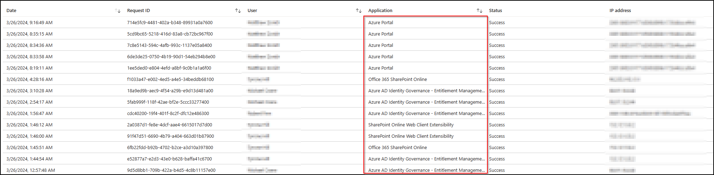

You can filter these logs to specific users or IP addresses, or any of the other fields. You can also download these events as a CSV or JSON. If you send these logs to Microsoft Sentinel, or another SIEM you can investigate the logs there directly.

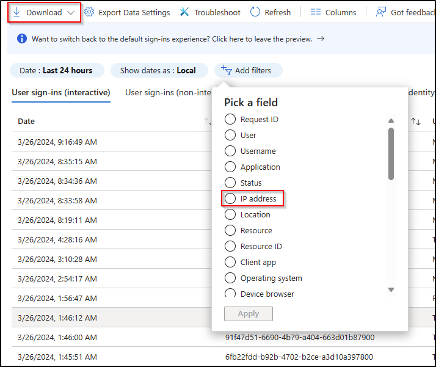

Once you have filtered the events down to those you believe are malicious, perhaps based off IP address information, or other indicators of compromise. You will be able to investigate which applications were accessed, which will shape your investigation.

For example, if an adversary had signed into SharePoint Online, or Exchange Online, then you should investigate those applications further. You also may have non Microsoft line of business applications in the list, any audit events for those should also be reviewed.

## Microsoft Entra ID Audit logs

The Microsoft Entra ID Audit log tracks changes to the tenant itself, and can include things such as MFA changes on user accounts, new users being created, changes to tenant level policy and more. This log source is crucial to understand what changes a threat actor made to the compromised user. If the compromised user also held privileges in Microsoft Entra ID, such as being a Global Administrator, then it will also show what administrative changes were made.

You can view what roles a user is assigned by clicking the assigned roles tab on the users page in the Microsoft Entra ID portal.

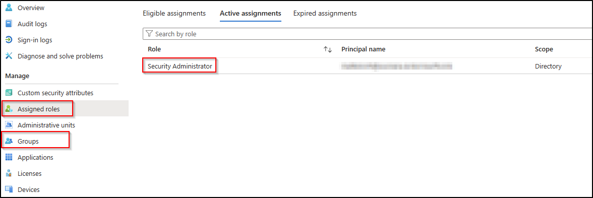

Additionally, you should review which groups the user is a member of to understand any potential access to line of business applications or corporate data.

Much like sign-in logs, the audit log is available in the Microsoft Entra ID portal. For all events, you will get a high level view of the operation completed.

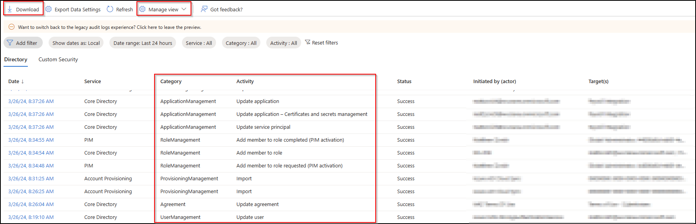

Like the sign-in logs, you can download the events to CSV or JSON, or send them to your SIEM to query directly. It is recommended on this page to select 'Manage view' and select all the columns so the view is as verbose as possible.

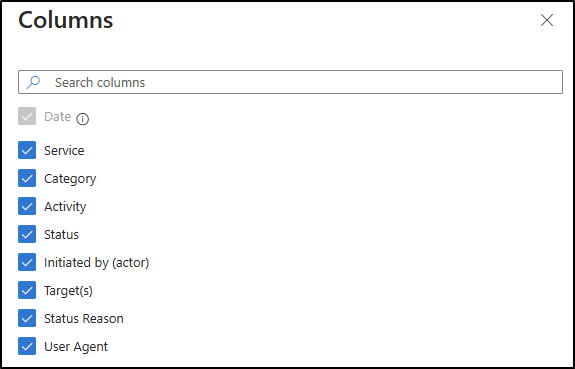

You can also further filter this log on the Target and Initiated by (actor)

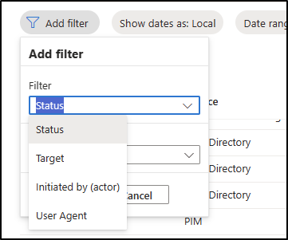

All audit events have a concept of the target and actor. Take the example of an administrator creating a new user. The administrator is the one who completed the action, so they are the actor. The new user is the target.

For some events, the actor and the target will be the same person. If you reset your own password, you would be both the actor and the target of that action.

For user compromise it is worth investigating events where that user is both the actor and the target. There will likely be legitimate activity mixed in with malicious activity, so events should be deconflicted to confirm if they are malicious.

If you click on a specific event, you will get the details associated with it.

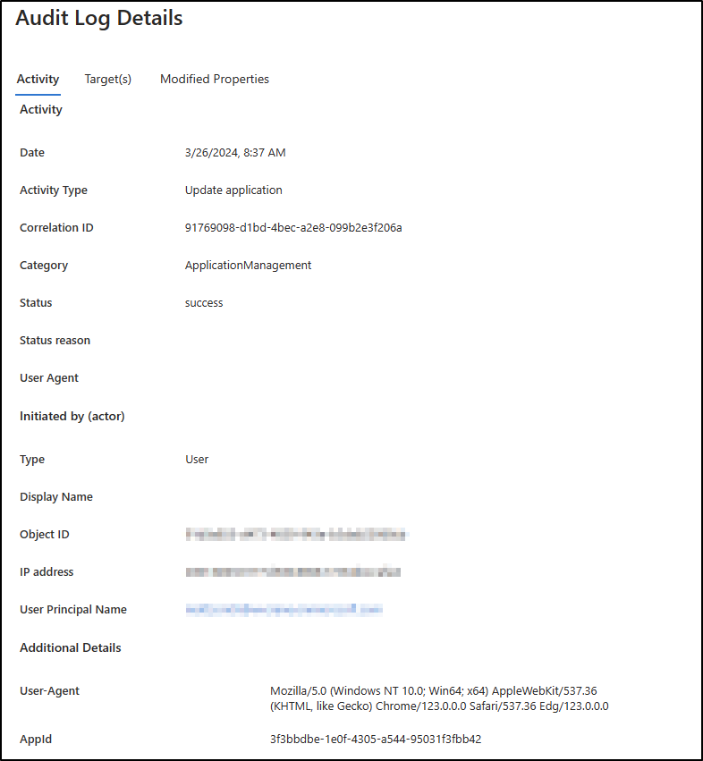

In this case, an application was updated.

## Microsoft Defender for Cloud Apps 

For organizations covered by the appropriate licensing, Microsoft Defender for Cloud Apps (MDCA) tracks activity through Microsoft 365 applications, such as SharePoint Online. Additionally, it is possible to connect services such as Microsoft Azure, or line of business applications like Service-Now. 

The MDCA activity log can be viewed in the [Microsoft Defender XDR portal](https://security.microsoft.com)

Like other portals, the log can be filtered on specific users, IP addresses. You can filter on specific applications of interest, so if you knew an advesary had accessed SharePoint Online as a compromised user, you could look for only events for SharePoint.

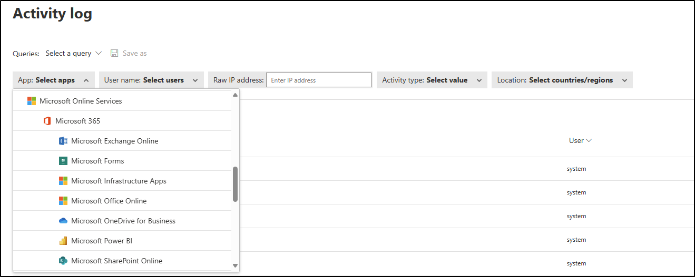

You can further filter to specific activities within that application, so for SharePoint, you could filter for only download events

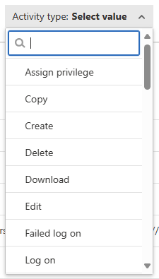

MDCA is a valuable tool to understand the impact to business data as a result of user compromise. The logs from MDCA can be sent to your SIEM for direct analysis.

## Unified Audit Log

The Unified Audit Log (UAL) is a centralized log source for multiple products, including Microsoft 365 services, Microsoft Entra ID and others. Depending on the size of the organization, the UAL can be immense in size, so must be queried to return only specific results, or for specific users. Results are categorized into workloads, which relate to the top level categorizion of the record, such as 'Exchange' or 'OneDrive'.

Under those top level categorizations, there are Record Types, which further help to group activities together, for example operations related to files in SharePoint have the Record Type of 'SharePointFileOperation'.

Finally, there are a list of operations, and relate to the specific action that occured, such as 'FileDownloaded'.

For a user that has been compromised, it is recommended to retrieve the UAL for that user and analyze the events that occurred to determine impact to the business.

The UAL can be searched in the [Microsoft Defender XDR portal](https://security.microsoft.com)

The portal has a intuitive UI used to filter your results.

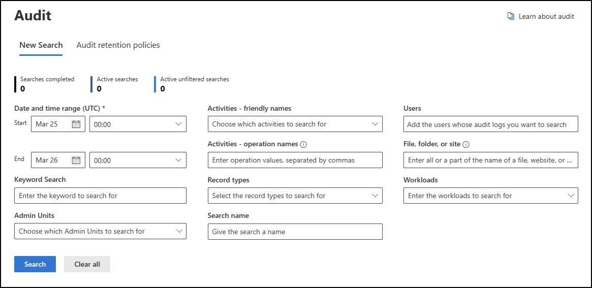

You can filter on users, workloads, operations, and even a free text 'Keyword' field. For example, the below query would find file download events from SharePoint from March 1, 2024 to March 25, 2024.

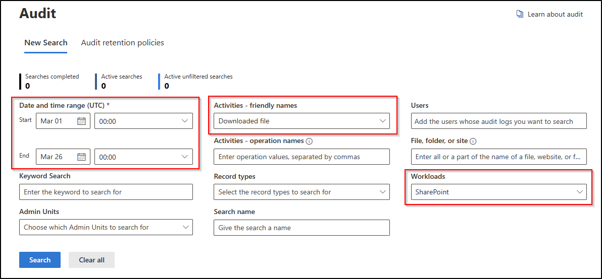

Once an audit query has been completed, the results can be downloaded to CSV and analyzed.

Microsoft has previously published guidance on best practices for searching the UAL - [Good UAL Hunting](https://techcommunity.microsoft.com/t5/microsoft-security-experts-blog/good-ual-hunting/ba-p/3718421)

## Azure Activity Log 

If a user was compromised that had privileges in Microsoft Azure, the Azure Activity log can be queried to understand what activities took place in Azure.

Much like the other portals, the Azure Activity log can be filtered to look at particular time ranges, users or resources.

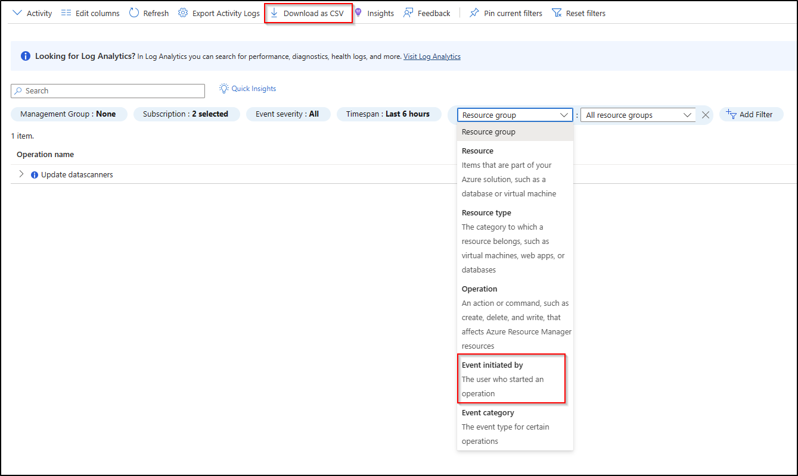

If you click on any specific event, you will be given the granular details. For example, in this event a virtual machine was started.

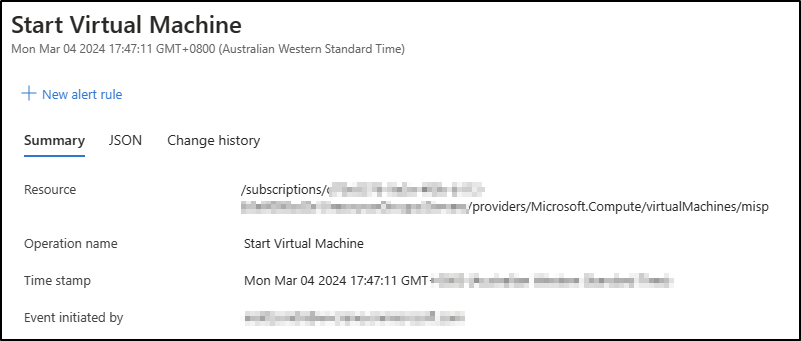

The Azure Activity logs can be sent to your SIEM for direct analysis.

## Microsoft Graph Activity Log

This log tracks requests against the Microsoft Graph and is currently [in preview](https://learn.microsoft.com/en-us/graph/microsoft-graph-activity-logs-overview). It is not currently accessible via a portal, but must be instead be sent to Microsoft Sentinel or another SIEM, or sent to storage.

If a user is compromised, the adversary may use that account to perform reconnaissance, or other actions, against your Microsoft Entra ID tenant. This activities may stand out as anomalous compared to usual behavior for that user.

User actions against Microsoft Graph can be queried in Sentinel or another SIEM to hunt for anomalies.

## Hunting queries

The following queries may help with investigating user compromise. Though written for Microsoft Sentinel, they can be converted to any SIEM language, such as Splunk or QRadar.

### Compromised user and IP summary

This query summarizes application access for a compromised user and malicious IP address combination. It includes the total count, first and last seen timestamps for each application successfully accessed. From this you can determine which applications need investigating.

```kql
SigninLogs
| where UserPrincipalName =~ "user@domain.com"
| where IPAddress == "ip address"
| where ResultType == 0
| summarize TotalCount=count(), FirstSeen=min(TimeGenerated), LastSeen=max(TimeGenerated) by AppDisplayName
```

### Microsoft Entra ID audit log summary

This query summarizes the audit events for a specific user in Microsoft Entra ID. It includes activities where the user was both the actor and the target.

```kql
AuditLogs
| where InitiatedBy has "user@domain.com" or TargetResources has "user@domain.com"
| summarize TotalCount=count() by OperationName, Category
```

### Microsoft Defender for Cloud Apps events

This query finds any events that belong to a specific user and any one of a set of IP addresses. If a user is compromised and you find multiple malicious IP addresses associated with the activity, this will find the events belonging to that combination of indicators.

```kql
CloudAppEvents
| where RawEventData has "user@domain.com" and RawEventData has_any ("ip address 1","ip address 2")
```

### Successful user events in the Azure Activity log

This query finds any successful activity in the Azure Activity log from a specific user. If a compromised user makes subscription level changes in Azure, they will be logged here.

```kql
AzureActivity
| where Authorization has "user@domain.com"
| where ActivityStatusValue == "Success"
```

### Pattern of life for user graph access

This query creates a pattern of life for user access against Microsoft Graph for each IP address and HTTP method for that user, including the total count of events and first and last seen timestamps. Higher counts of activities or new requests may stand out as anomalous. This data source uses the UserId of a user instead of the UserPrincipalName.

```kql
MicrosoftGraphActivityLogs
| where UserId == "userId of compromised user"
| summarize TotalCount=count(), FirstSeen=min(TimeGenerated), LastSeen=max(TimeGenerated), Requests=make_set(RequestId) by IPAddress, RequestMethod
```

### Graph activity visualization

This query creates a visualization showing all the Microsoft Graph access for a specific user, large spikes in activity may align with malicious activity.

```kql
MicrosoftGraphActivityLogs
| where TimeGenerated > ago(30d)
| where UserId == "userId of compromised user"
| make-series Count=count() default=0 on TimeGenerated step 4h
| render timechart 
```